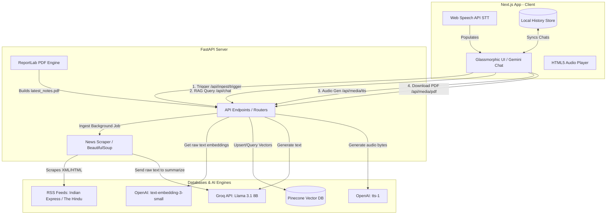

# KarmaaFlow AI: Current Affairs RAG Tutor (SSC Exam)

This document provides a highly detailed explanation of the project's data flow, architecture, APIs, and components. It is structured to help you understand every technical aspect of the system for resume and interview preparation.

---

## 1. System Architecture Overview

The system is built as a decoupled **RAG (Retrieval-Augmented Generation)** application comprising:
1. **Frontend (Client)**: Built with Next.js, React, Tailwind CSS v4, and Framer Motion. Uses native browser Web Speech API for Speech-to-Text (STT).
2. **Backend (Server)**: A Python FastAPI application that exposes RAG endpoints, handles media processing, and orchestrates background workers.
3. **Vector Database**: Pinecone Cloud (Serverless spec on AWS), storing 1536-dimensional vectors.
4. **LLM Engine**: Groq API hosting `llama-3.1-8b-instant` for ultra-fast, structured reasoning and summarization.
5. **AI Auxiliary Services (OpenAI)**: 
   - `text-embedding-3-small` (1536 dimensions) for vector representations.
   - `tts-1` (Alloy voice) for backend-driven Text-to-Speech synthesis.



---

## 2. In-Depth Data Flows

### A. Data Ingestion & Embedding Pipeline (The Ingestion Flow)

This is a background pipeline triggered when the user clicks **Refresh News** or via an automated scheduler.

1. **Triggering**:
   - The frontend sends a `POST` request to `/api/ingest/trigger`.
   - The backend accepts the request and spins up a background task (`process_news_pipeline`) so the HTTP response returns immediately without making the client wait.
2. **Scraping**:
   - The backend uses `requests` with a custom `User-Agent` string (spoofing a desktop Chrome browser to bypass basic anti-bot blockers) to fetch RSS XML feeds from *The Hindu* and *The Indian Express*.
   - `feedparser` parses the XML to extract the article title, direct URL link, and summary snippet.
   - If the snippet is too short (< 150 characters), `BeautifulSoup` performs an additional HTTP request to parse the body elements (`<p>` tags) of the original article page.
3. **AI Fact Extraction**:
   - The raw text is passed to **Groq (`llama-3.1-8b-instant`)**.
   - **System Prompting**: The model is instructed to act as an expert tutor for the Indian Staff Selection Commission (SSC) Exam. It distills the news into a clean, 3-4 bullet-point summary focusing exclusively on dry exam-relevant facts (e.g., Dates, Names, Ministries, Treaties, Statistical figures).
4. **Vector Embedding**:
   - The distilled factual summary is sent to the **OpenAI Embeddings API** (`text-embedding-3-small`).
   - OpenAI converts the text string into a mathematical representation: a dense vector containing **1536 floating-point values**.
5. **Storage (Upsert)**:
   - The backend computes a deterministic UUIDv5 identifier for the article using its source URL. This prevents duplicate entries in the database if the scraper runs multiple times.
   - The vector is upserted to the **Pinecone index (`current-affairs`)**. The text summary, title, and original URL are attached as metadata payloads to the vector.
6. **PDF Generation**:
   - The summaries are passed to the `ReportLab` engine.
   - A PDF document is dynamically compiled using flowables (`Paragraph`, `Spacer`, `SimpleDocTemplate`) and saved locally at `/app/static/latest_notes.pdf` for direct download.

---

### B. The Retrieval-Augmented Generation (RAG) & Chat Loop

This describes the execution flow when a user submits a question or clicks a suggestion card.

```
[User Input] ──> [Next.js Client] ──(POST /api/chat/)──> [FastAPI Backend]
                                                               │
   ┌───────────────────────────────────────────────────────────┘
   ▼
1. [OpenAI Embeddings API] ──> Converts question to 1536-dim Vector
   │
   ▼
2. [Pinecone Vector Search] ──> Vector similarity search (Cosine Distance)
   │
   └─(Returns Top 3 Matches)─> Extracts text metadata summaries
                                 │
   ┌─────────────────────────────┘
   ▼
3. [Prompt Engineering] ──> Injects Context + Question into SSC System Prompt
   │
   ▼
4. [Groq LLM API] ──> Compiles grounded factual response
   │
   ▼
[FastAPI Backend] ──(JSON Response)──> [Next.js Client UI]
```

1. **Request**:
   - The frontend issues a `POST` request to `/api/chat/` with JSON body: `{"question": "What is the new GDP forecast for India?"}`.
2. **Query Vectorization**:
   - The backend calls the OpenAI embeddings function (`get_embedding`), passing the user's question. This produces a 1536-dimensional query vector.
3. **Similarity Search (Retrieval)**:
   - The backend queries Pinecone using `index.query()`, passing the query vector and specifying `top_k=3` and `include_metadata=True`.
   - Pinecone measures the **cosine angle** between the query vector and all stored vectors in the index, returning the 3 closest matches.
4. **Context Isolation**:
   - The backend extracts the metadata fields (`summary` and `title`) of the top 3 matches and concatenates them into a single string block called `Context`.
5. **LLM Inference (Generation)**:
   - The backend constructs a structured prompt injecting the retrieved context:
     ```
     You are an AI teaching assistant for the SSC Exam. Answer the user's question based ONLY on the provided Context. If the answer is not in the context, say 'I do not have enough daily news context to answer this'.
     Context: {retrieved_context_from_pinecone}
     Question: {user_question}
     ```
   - This prompt is dispatched to **Groq (`llama-3.1-8b-instant`)**.
   - Groq generates a concise answer, ensuring it is grounded strictly in the context (eliminating hallucinations).
6. **Response**:
   - The backend returns a JSON payload to the client:
     ```json
     {
       "answer": "According to the Indian Express, India's GDP forecast for FY26 has been adjusted to...",
       "context_used": true
     }
     ```

---

### C. Voice Input & Output Pipeline

#### 1. Speech-to-Text (STT) - Client-side
- The frontend utilizes the browser's native **Web Speech API** (`window.SpeechRecognition` / `webkitSpeechRecognition`).
- When the microphone icon is toggled, the browser captures native audio, performs speech recognition locally (using Google Chrome's built-in cloud/device model), and updates the React input field state in real-time.
- **Advantage**: 100% free, low latency, and requires zero backend computing resources.

#### 2. Text-to-Speech (TTS) - Server-side
- When the user clicks the **Listen** button underneath an AI response, the client makes a `POST` request to `/api/media/tts` with the message text.
- The FastAPI backend forwards the request to **OpenAI's TTS API** (`model: tts-1`, `voice: alloy`).
- OpenAI returns raw audio bytes (`mp3` format).
- The backend wraps these bytes in a FastAPI `Response` object with `media_type="audio/mpeg"`.
- The Next.js frontend receives the response, converts the incoming binary blob into a temporary browser URL (`URL.createObjectURL(blob)`), and plays it using standard HTML5 `Audio()` objects.

---

## 3. Communication Protocols & APIs

The frontend and backend interact entirely via **asynchronous HTTP REST APIs**.

### Endpoints Table

| Method | Endpoint | Description | Request Body | Response Type |
| :--- | :--- | :--- | :--- | :--- |
| `POST` | `/api/ingest/trigger` | Manually starts news ingestion pipeline in background | None | `application/json` |
| `POST` | `/api/chat/` | Sends user prompt, queries database, returns AI response | `{"question": "string"}` | `application/json` |
| `POST` | `/api/media/tts` | Synthesizes text into high-quality spoken audio | `{"text": "string"}` | `audio/mpeg` |
| `GET` | `/api/media/pdf` | Downloads the generated Daily Current Affairs PDF | None | `application/pdf` |

---

## 4. Frontend State & Session Management

- **Session Schema**:
  ```typescript
  interface ChatSession {
    id: string;
    title: string;
    messages: Message[];
    updatedAt: number;
  }
  ```
- **Syncing to Local Storage**:
  On every message sent or received, the active chat session is updated, and the entire `sessions` array is serialized to JSON and saved in the browser's `localStorage` (`karma_flow_sessions`).
- **Sidebar Navigation**:
  On component mount, `localStorage` is loaded. The list of recent chats is rendered in the collapsible sidebar. Clicking a chat sets the active state `currentSessionId` and updates the active message stream.
- **Empty State Resolution**:
  If the current chat session has 0 messages, the app hides the conversation stream and loads the visual landing page containing the suggestion cards. Sending a message automatically moves the session into active mode, creating a dynamic user experience.
