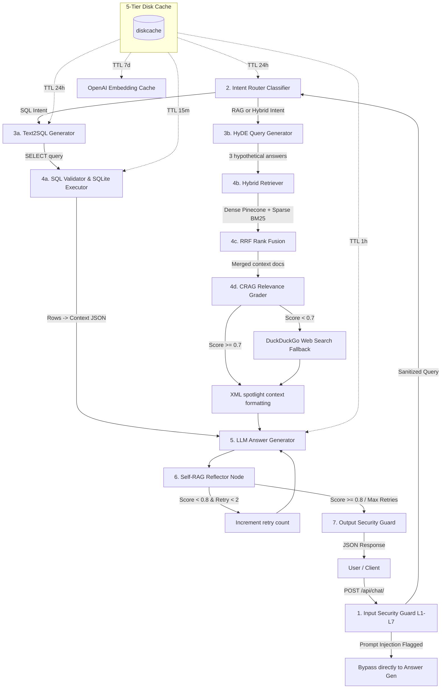

# KarmaaFlow AI: Advanced RAG System Architecture (SSC Exam)

This document provides a comprehensive technical breakdown of the production-grade **Advanced RAG (Retrieval-Augmented Generation)** architecture implemented in your backend. This system is designed using a State Machine workflow, security guardrails, and hybrid query paths.

---

## 1. System Architecture & Workflow Diagram

The system operates as a stateful graph powered by **LangGraph** which handles input security, intent classification, conditional query routing (RAG vs. Text2SQL), context evaluation, LLM response generation, and self-reflection loops.

---

## 2. Advanced RAG Component Pipeline

### Tier 1: Input Security Guard (L1-L7 Protection)
- **L1 (Injection Scan)**: Regular expression matching scans user inputs for SQL injection patterns (`DROP`, `DELETE`, `ALTER`) and system prompt override attempts (`ignore previous instructions`).
- **L5 (Token Budgeting)**: Using `tiktoken`, query sizes are tokenized (`cl100k_base` encoding) and truncated to a maximum of 250 tokens to prevent resource exhaustion attacks.
- **L7a (PII Redaction)**: Basic email regex and 10-digit phone number regex filters replace sensitive user information with `[REDACTED_EMAIL]` and `[REDACTED_PHONE]` tags.
- **Bypass Route**: If prompt injection is flagged, the graph immediately routes to the output block node, preventing unnecessary database and vector queries.

### Tier 2: 5-Tier Cache (`diskcache`)
A local disk-backed cache manages query metadata to speed up repetitive queries and reduce API costs:
1. **Embedding Cache (7d TTL)**: Caches vector representation coordinates.
2. **Intent Cache (24h TTL)**: Saves query routing decisions.
3. **SQL Query Cache (24h TTL)**: Caches Text2SQL SQLite query translations.
4. **SQL Result Cache (15m TTL)**: Caches database row results.
5. **RAG Answer Cache (1h TTL)**: Caches final LLM answers mapped to the query and spotlighted context.

### Tier 3: Query Intent Router
An LLM intent router reads the SQLite metadata database schema and classifies the input into:
- **`sql`**: Routed to Text2SQL for analytics and system metadata (e.g. counts, lists of sources, active statuses).
- **`rag`**: Routed to vector lookup for factual current affairs.
- **`hybrid`**: Triggers both pipelines or combines results.

### Tier 4: RAG Pipeline
* **HyDE (Hypothetical Document Embeddings)**: Generates 3 hypothetical answers using Groq first. This query expansion method translates abstract questions into paragraph structures, matching the news summaries more effectively during search.
* **Hybrid Retrieval (Dense + Sparse)**:
  - **Dense search**: Pinecone cosine similarity queries using the OpenAI vector embedding.
  - **Sparse search**: Matches keyword frequencies over local documents using a dynamic **BM25 index** (`rank_bm25`).
* **RRF (Reciprocal Rank Fusion)**: Rank indices from Pinecone and BM25 are merged mathematically using reciprocal rank scores:
  $$Score_{RRF}(d) = \sum_{m \in M} \frac{1}{60 + Rank_m(d)}$$
  This highlights documents that perform well across both keyword matching and semantic searches.
* **CRAG (Corrective RAG) & Web Fallback**: An LLM-based grader measures retrieved document relevance. If the score falls below `0.7`, the system activates a **DuckDuckGo Web Search** scraper to append real-time web context, ensuring the AI never runs dry on answers.
* **XML Spotlighting**: Context documents are injected into the prompt wrapped in XML tags (`<context_document id="N">...</context_document>`). This visual boundaries indicator guides the LLM to focus on specific context regions, improving accuracy.

### Tier 5: Text2SQL Pipeline
- Translates analytical questions into SQL SELECT queries.
- **Validator**: Restricts SQL statements to `SELECT` operations only, screening out blacklisted keywords (`DROP`, `DELETE`, `UPDATE`, `CREATE`) to guarantee data security.
- **Executor**: Runs queries against a local SQLite database (`ops_database.db`) seeded with article metrics, user analytics, and system states.

### Tier 6: Self-RAG Reflection
- After generating the answer, the LLM runs a verification self-reflection step.
- It grades whether the generated answer is fully supported by the provided facts.
- If the verification score is `< 0.8` (indicating potential hallucination or gaps), the graph automatically retries generation (up to 2 attempts) to refine the output.

### Tier 7: Output Security Guard
- Evaluates the final response to ensure schema conformity and returns the result securely back to the API client.

---

## 3. Resume Power-Keywords & Summaries

When representing this on your resume or discussing it in interviews, highlight these engineering concepts:
* **Orchestration**: Stateful multi-agent graph orchestration using **LangGraph**.
* **Query Optimization**: Hypothetical Document Embeddings (**HyDE**) and Hybrid Search (**Dense + Sparse BM25**) with Reciprocal Rank Fusion (**RRF**).
* **Self-Healing LLMs**: Self-RAG reflection nodes performing real-time accuracy auditing.
* **Security Guardrails**: Multilayered **Input/Output Security Gateways** protecting against prompt/SQL injection attacks.
* **Hybrid Data Paths**: Combining **Vector Search (Pinecone)** with relational database **Text2SQL (SQLite)**.
